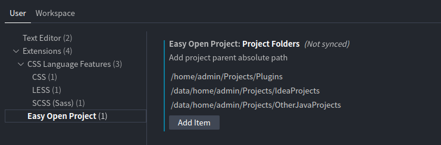

# easy-open-project

Open projects via custom list easily. Install via the [VSCode Marketplace](https://marketplace.visualstudio.com/items?itemName=newhoo.easy-open-project) or see [Installation Instructions](https://code.visualstudio.com/api/working-with-extensions/publishing-extension#packaging-extensions).

## Usage

- Open `View` -> `Command Palette` -> `Easy Open Project` -> `Select folder to open`

- Extension Settings

## Requirements

VSCode 1.73.0 or newer

## Development

Compile before debugging. Debug (F5) while editing `extension.ts` to spawn a VSCode debug instance.
