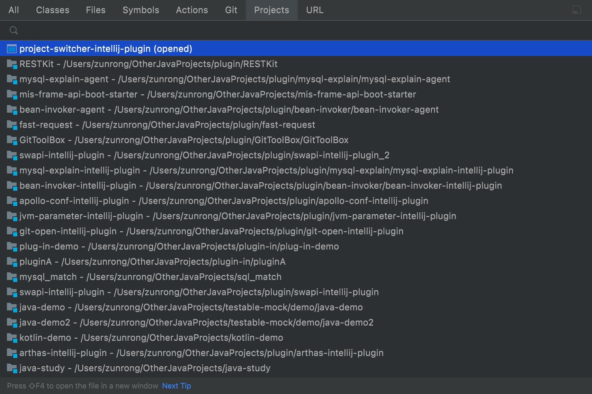
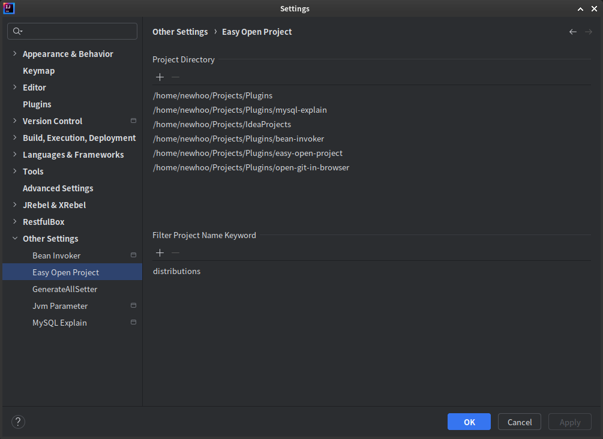

# easy-open-project-intellij-plugin

## A plugin that helps to switch project conveniently.

Main functions:
    
- Show project list
- Switch opened projects
- Open a project
- Close opened projects

Quick path:

- Top menu: Navigate/Project...(Ctrl/Command Shift P)
- SearchEvery: Double click shift, switch to tab "Projects"
- Right option/alt on project list to close selected project

Preview:

